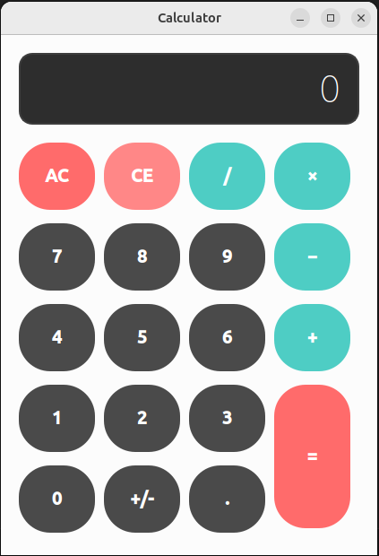

# 🧮 쌀집 계산기 (Calculator)

PyQt6로 개발된 데스크톱 계산기 애플리케이션입니다. 정확한 소수점 계산과 직관적인 사용자 인터페이스를 제공합니다.



---

## ✨ 주요 기능

### 🔢 기본 연산
- **사칙연산**: 덧셈(+), 뺄셈(-), 곱셈(×), 나눗셈(/)
- **연속 계산**: 계산 결과 후 연산자를 누르면 자동으로 이어서 계산
- **정밀 계산**: Python `Decimal` 모듈을 사용하여 부동소수점 오차 없이 정확한 계산

### 🎯 편의 기능
- **부호 변경**: `+/-` 버튼으로 양수/음수 전환
- **소수점 입력**: 정수에 소수점 추가 가능
- **현재 입력 초기화 (CE)**: 현재 입력 중인 숫자만 초기화
- **전체 초기화 (AC)**: 모든 상태 초기화
- **한 글자 삭제**: Backspace로 마지막 입력 문자 삭제
- **키보드 입력 가능**: 모든 기능을 키보드로도 사용 가능

### ⌨️ 키보드 단축키
- **숫자 키 (0-9)**: 숫자 입력
- **연산자 키**: `+`, `-`, `*`, `/` - 연산 수행
- **Enter / =**: 계산 실행
- **Backspace**: 한 글자 삭제 (C)
- **Shift + Backspace**: 전체 삭제 (AC)
- **Ctrl + Backspace**: 현재 입력값만 초기화 (CE)
- **ESC**: 프로그램 종료

### ⚠️ 에러 처리
- **0으로 나누기 방지**: 0으로 나누기 시 "ERR" 표시
- **에러 상태 관리**: 에러 발생 시 AC 버튼으로 초기화 필요

---

## 🛠️ 기술 스택

- **GUI 프레임워크**: PyQt6
- **정밀 계산**: Python `Decimal` 모듈 (정밀도 10자리)
- **UI 디자인**: Qt Designer (`.ui` 파일)
- **정규표현식**: `re` 모듈 (소수점 패턴 검증)

---

## 🎨 주요 특징

### 1. 정확한 소수점 계산
일반 계산기의 부동소수점 오차 문제를 해결하기 위해 `Decimal` 모듈을 사용하여 정확한 계산을 보장합니다.

```python
# 예시: 일반 계산기에서는 0.1 + 0.2 = 0.30000000000000004
# 이 계산기에서는 0.1 + 0.2 = 0.3 (정확한 결과)
```

### 2. 직관적인 상태 관리
- **쌀집 계산기 방식**: 계산 결과를 누적하여 연속 계산 가능
- **상태 기반 로직**: accumulator, operator, operator_entered 플래그를 통한 명확한 상태 관리
- **에러 상태 처리**: 에러 발생 시 명확한 피드백 제공

### 3. 사용자 친화적 UI
- **모던한 디자인**: 다크 테마와 둥근 모서리 버튼
- **색상 구분**: 
  - 숫자 버튼: 다크 그레이
  - 연산자 버튼: 틸/터키즈 블루
  - 초기화 버튼: 코랄/레드
- **큰 폰트**: 가독성을 위한 큰 폰트 크기

### 4. 키보드 입력 지원
마우스 없이 키보드만으로도 모든 기능을 사용할 수 있습니다.

---

## 🚀 설치 및 실행

### 요구사항
```bash
pip install PyQt6
```

### 실행 방법
```bash
python calc.py
```

---

## 📁 프로젝트 구조

```
src/
├── calc.py              # 메인 애플리케이션 코드
├── calc.ui              # UI 디자인 파일 (Qt Designer)
├── calculator.png       # 스크린샷
├── 기능리스트.md        # 상세 기능 문서
└── README.md           # 프로젝트 소개 문서
```

---

## 💡 사용 예시

### 기본 계산
```
1. 숫자 입력: 123
2. 연산자 선택: +
3. 숫자 입력: 456
4. 등호(=) 또는 Enter: 결과 579 표시
```

### 연속 계산
```
1. 10 + 5 = 15
2. * 2 = 30 (이전 결과 15에 2를 곱함)
3. - 10 = 20 (이전 결과 30에서 10을 뺌)
```

### 새로운 계산 시작
```
1. 계산 결과 후 숫자 버튼 클릭
2. 자동으로 새로운 계산 시작
```

---

## 🔍 핵심 구현 내용

### 상태 관리 시스템
```python
self.accumulator = None      # 이전 계산 결과 또는 첫 번째 피연산자
self.operator = None         # 현재 연산자 (+, -, *, /)
self.operator_entered = False  # 연산자 입력 플래그
self.has_error = False      # 에러 상태 플래그
```

### 정확한 계산 함수
```python
def calculate(operator, operand1, operand2):
    op1 = Decimal(str(operand1))
    op2 = Decimal(str(operand2))
    # 정확한 계산 수행
```

### 키보드 이벤트 처리
```python
def keyPressEvent(self, e):
    # 숫자, 연산자, 단축키 처리
    # Shift/Ctrl 조합 키 지원
```

---

## 📝 개발 노트

이 프로젝트는 다음과 같은 설계 원칙을 따릅니다:

1. **명확한 상태 관리**: 계산기의 상태를 명확하게 정의하고 관리
2. **에러 처리**: 사용자에게 명확한 에러 피드백 제공
3. **사용자 경험**: 키보드와 마우스 모두 지원하여 편의성 향상
4. **코드 가독성**: 주석과 문서화를 통한 코드 이해도 향상
